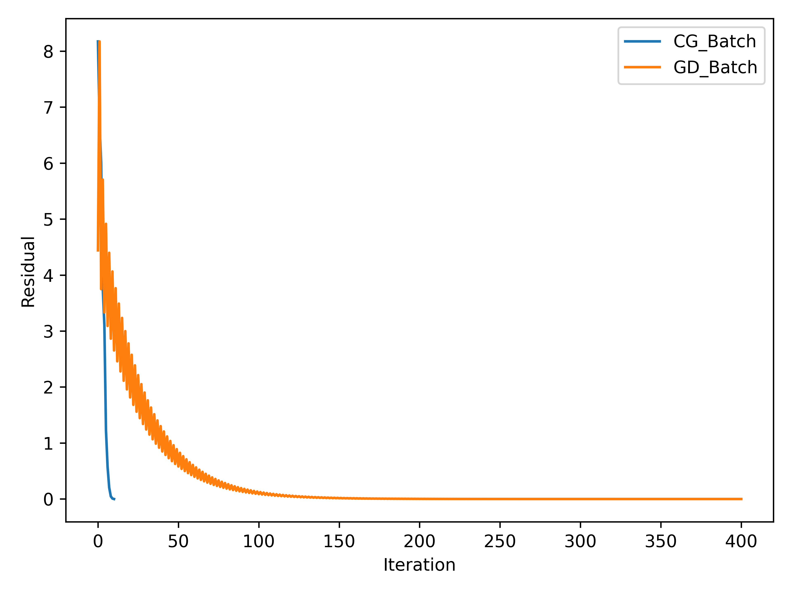
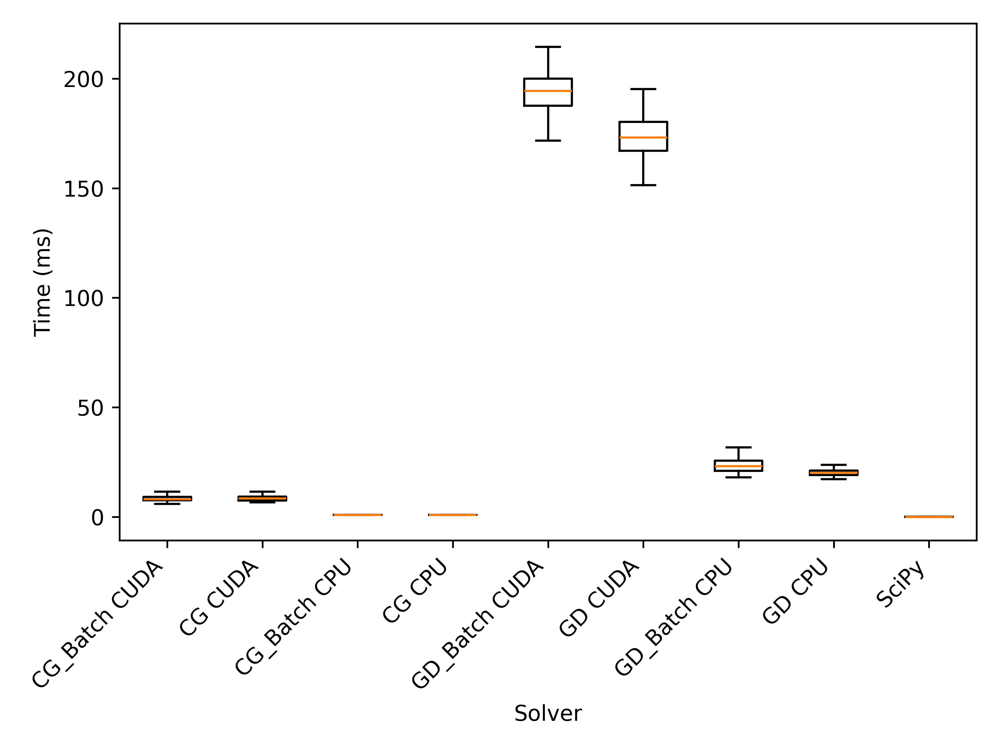

Conjugate Gradient (CG) and Gradient Descent (GD) in PyTorch
============================================================

This repository contains the implementation of the Conjugate Gradient (CG) and Gradient Descent (GD) optimization algorithms in PyTorch. 
In particular, both CG and GD are provided as batched and non-batched versions and can be run on either CUDA or CPU. 

In the batched version, we attempt to solve problems of the form: 

$$\min_{x_i} \Vert A_ix_i - b_i \Vert_2^2$$

for all $i$ simultaneously.

In the non-batched version, we solve the problem: 

$$\min_x \Vert A_x - b \Vert_2^2.$$

Usage
-----
For the batched version, we expect input tensors `A` and `b` to be of shape `(B, N, N)` and `(B, N, 1)` respectively. If an optional initial guess `x0` is provided, it should be of shape `(B, N, 1)`. The output `x` will be of shape `(B, N, 1)`.

```python
from batch_optim import CG_Batch

# Create a random positive definite matrix A
A = torch.randn(1, 20, 10).double()
A = torch.bmm(A, A.mT) + 1 * torch.eye(20).double().unsqueeze(0)

# Create a random vector b
b = torch.randn(1, 20, 1).double()

# Create an initial guess x0 to be all zeros
x0 = torch.zeros(1, 20, 1).double()

# Create a CG object
cgb = CG_Batch(A, b, x0, tol=1e-6, device='cuda')

# Run the CG algorithm
res = cgb()

# Print the result
print(f"x: {res['x']}")
print(f"Residual: {res['residual']}")
print(f"Iterations: {res['iter']}")
```

Usage for the non-batched version and the GD algorithm is similar. 

Performance
-----------

Running the testing script that comes with the code `batch_optim.py`, one would expect the following output:

```python
==============================
CGB CUDA time: 8.727ms ± 2.180ms
Iter: 10
Residual: 4.973e-12
==============================
CG CUDA time: 8.704ms ± 1.799ms
Iter: 10
Residual: 4.973e-12
==============================
GDB CUDA time: 194.452ms ± 9.889ms
Iter: 400
Residual: 9.916e-07
==============================
GD CUDA time: 174.652ms ± 11.413ms
Iter: 400
Residual: 9.916e-07
==============================
CGB CPU time: 1.082ms ± 0.409ms
Iter: 10
Residual: 4.381e-12
==============================
CG CPU time: 1.101ms ± 0.445ms
Iter: 10
Residual: 4.381e-12
==============================
GDB CPU time: 23.842ms ± 4.482ms
Iter: 400
Residual: 9.916e-07
==============================
GD CPU time: 20.489ms ± 1.948ms
Iter: 400
Residual: 9.916e-07
==============================
SciPy CPU time: 0.248ms ± 0.438ms
```

The above experiment was run on a Windows laptop with AMD Ryzen 9 6900HX CPU and NVIDIA GeForce RTX 3070 Ti Laptop GPU. 

The results produced by the batched versions are consistent with the non-batched versions. 



As expected, CG converges in fewer iterations than GD. 



For the particular linear problem tested, running on CPU is slightly faster than running on GPU. But one should expect the opposite for larger problems.
